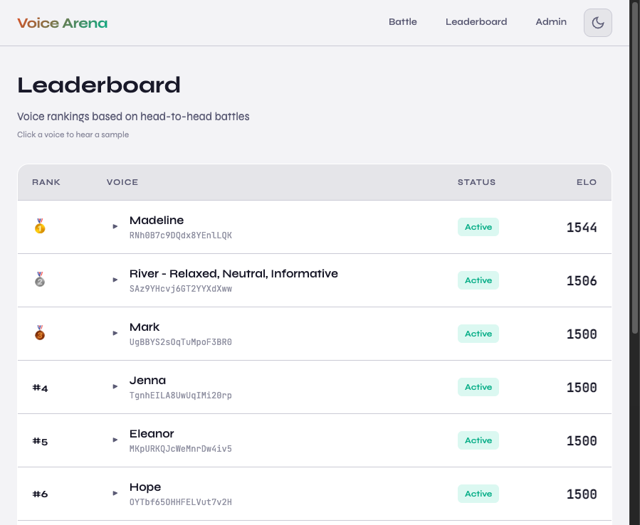

# Voice ELO Arena

A head-to-head voice comparison platform that ranks TTS voices using an ELO rating system. Compare voices from multiple providers (ElevenLabs, Cartesia) and discover which ones sound best.



## Features

- **🎯 Blind Comparisons**: Listen to two voices reading the same script, then vote for the one that sounds better
- **📊 ELO Rankings**: Voices are ranked using the ELO rating system (like chess!)
- **🔊 Multi-Provider Support**: Compare voices from ElevenLabs and Cartesia
- **💾 Smart Caching**: TTS audio is cached for 7 days to reduce API costs
- **⏱️ Rate Limiting**: Built-in protection against abuse (10 TTS requests/minute per IP)
- **🔐 Admin Protection**: Password-protect the admin dashboard
- **🌙 Dark/Light Mode**: Toggle between themes

## Quick Start

### Prerequisites

- Node.js 18+
- API keys for [ElevenLabs](https://elevenlabs.io) and/or [Cartesia](https://cartesia.ai)

### Local Development

1. **Clone and install dependencies:**
   ```bash
   git clone https://github.com/your-username/voice-elo.git
   cd voice-elo
   npm install  # or bun install
   ```

2. **Set up environment variables:**
   ```bash
   cp .env.example .env
   # Edit .env with your API keys
   ```

3. **Initialize the database:**
   ```bash
   npx prisma db push
   ```

4. **Run the development server:**
   ```bash
   npm run dev  # or bun dev
   ```

5. **Open [http://localhost:3000](http://localhost:3000)**

6. **Add voices and scripts:**
   - Go to [http://localhost:3000/admin](http://localhost:3000/admin)
   - Import voices from ElevenLabs or Cartesia
   - Add scripts for comparison

## Deployment

### Vercel (Recommended)

1. **Set up a production database:**
   
   For Vercel, use one of these providers:
   - [Turso](https://turso.tech) (SQLite, recommended for simplicity)
   - [Neon](https://neon.tech) (PostgreSQL)
   - [PlanetScale](https://planetscale.com) (MySQL)

   For Turso, update your Prisma schema:
   ```prisma
   datasource db {
     provider = "sqlite"
     url      = env("DATABASE_URL")
   }
   ```

2. **Deploy to Vercel:**
   ```bash
   vercel
   ```

3. **Set environment variables in Vercel Dashboard:**
   - `DATABASE_URL`: Your production database URL
   - `ELEVENLABS_API_KEY`: Your ElevenLabs API key
   - `CARTESIA_API_KEY`: Your Cartesia API key
   - `ADMIN_PASSWORD`: A strong password for admin access

### Cloudflare Pages

1. **Set up D1 or Turso database**

2. **Deploy:**
   ```bash
   npm run build
   npx wrangler pages deploy .next
   ```

## Rate Limits & Restrictions

The app includes built-in protections for production use:

| Endpoint | Limit | Window |
|----------|-------|--------|
| TTS Generation | 10 requests | 1 minute |
| Matchups | 30 requests | 1 minute |
| Voting | 20 requests | 1 minute |

### Text Length Limits
- Maximum 1000 characters per TTS request

### Caching
- Generated audio is cached for 7 days
- Cache is keyed by (voice ID, script ID)
- Reduces API costs significantly for repeated matchups

## Environment Variables

| Variable | Required | Description |
|----------|----------|-------------|
| `DATABASE_URL` | Yes | Database connection string |
| `ELEVENLABS_API_KEY` | No* | ElevenLabs API key |
| `CARTESIA_API_KEY` | No* | Cartesia API key |
| `ADMIN_PASSWORD` | Recommended | Password for /admin routes |

\* At least one TTS provider key is required.

## API Routes

### Public
- `GET /api/matchup` - Get a random matchup
- `POST /api/tts` - Generate TTS audio (with caching & rate limiting)
- `POST /api/comparisons` - Submit a vote

### Admin (protected)
- `GET/POST /api/voices` - Manage voices
- `GET/POST /api/scripts` - Manage scripts
- `GET /api/elevenlabs/voices` - List ElevenLabs voices
- `GET /api/cartesia/voices` - List Cartesia voices

## Tech Stack

- **Framework**: Next.js 14 (App Router)
- **Database**: SQLite (dev) / Turso (production)
- **ORM**: Prisma
- **Styling**: Tailwind CSS + Custom CSS
- **TTS Providers**: ElevenLabs, Cartesia

## Security Considerations

1. **Admin Routes**: Always set `ADMIN_PASSWORD` in production
2. **Rate Limiting**: Built-in IP-based rate limiting
3. **Character Limits**: Max 1000 chars per TTS request
4. **Cache Cleanup**: Expired cache entries are periodically cleaned

## Contributing

Contributions welcome! Please open an issue or PR.

## License

MIT
